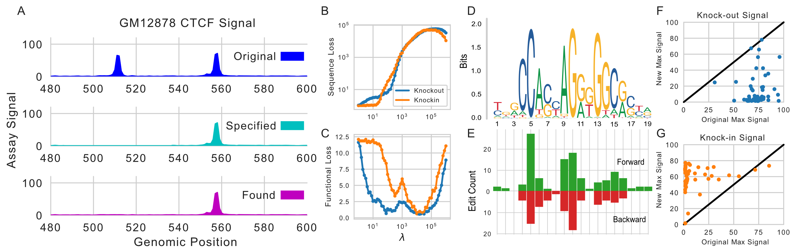

# Ledidi

Ledidi is an approach for designing edits to biological sequences that induce desired properties. A difficulty with this task is that biological sequences are discrete and so direct optimization can be difficult. Ledidi overcomes this challenge through using the Gumbel-softmax reparameterization trick to turn a discrete sequence input into a continuous representation where standard gradient descent methods can be applied easily. Ledidi differs from most current biological sequence design methods in that they generally design entire sequences that satisfy certain properties, whereas Ledidi designs compact sets of edits to given sequences that result in the desired outcome.

Currently, we've paired Ledidi with the [Basenji model](https://github.com/calico/basenji) and designed edits to the human genome that create CTCF binding, knock out CTCF binding, and induce cell-type specific binding of JUND. 

Take a look at our [preprint](https://www.biorxiv.org/content/10.1101/2020.05.21.109686v1)!

### Installation

You can install Ledidi with `pip install ledidi` and you can download the Basenji model we used with `wget https://storage.googleapis.com/basenji_barnyard/model_human.h5`, though any model is can be used with Ledidi.

### Example



The input to Ledidi is a biological sequence and a desired output from the model (A, cyan) and the output is an edited sequence and the output from the paired predictive model (A, magenta). A hyperparameter in the optimization process, lambda, controls the number of sequence edits made (B) and the distance between the returned output and the desired output (C). 

In this example Ledidi is knocking out or knocking in CTCF binding. When CTCF is knocked out, Ledidi makes an average of ~5 edits per locus, and these edits occurs primarily at the most conserved positions in the CTCF motif (on both strands, D/E). Ledidi was able to knock out or knock in CTCF binding at almost all loci. 

### Usage

Ledidi can be paired with any differentiable model, but provides a wrapper for regression models that are implemented in TensorFlow. Below is a code example that knocks out CTCF binding at a specific CTCF site. 

```python
import numpy
import tensorflow as tf

from ledidi import Ledidi
from ledidi import TensorFlowRegressor

from tensorflow.keras.models import load_model
from tensorflow.keras.utils import CustomObjectScope

# These two objects are necessary for the Basenji model
class GELU(tf.keras.layers.Layer):
    def __init__(self, **kwargs):
        super(GELU, self).__init__()
    
    def call(self, x, training):
        return tf.keras.activations.sigmoid(1.702 * x) * x

class StochasticShift(tf.keras.layers.Layer):
    def __init__(self, shift_max=0, pad='uniform', **kwargs):
        super(StochasticShift, self).__init__()

    def call(self, seq_1hot, training):
        return seq_1hot

custom_objects = {
    'StochasticShift': StochasticShift, 
    'GELU': GELU
}

model = load_model("model_human.h5", custom_objects)
model.compile()
regressor = TensorFlowRegressor(model=model)

# Index 687 is CTCF signal in GM12878
mask = numpy.zeros((1, 1024, 5313), dtype='float32')
mask[:, :, 687] = 1.0

mutator = Ledidi(regressor, mask=mask, l=1e2)

sequence = numpy.load("CTCF/CTCF-seqs.npz")['arr_0'].astype('float32')[0].reshape(1, 131072, 4)
epi = model.predict(sequence)

desired_epi = epi.copy()
desired_epi[0, 487:537, 687] = 0.0

edited_sequence = mutator.fit_transform(sequence, desired_epi)
found_epi = model.predict(edited_sequence.astype('float32'))[0, :, 687]
```
